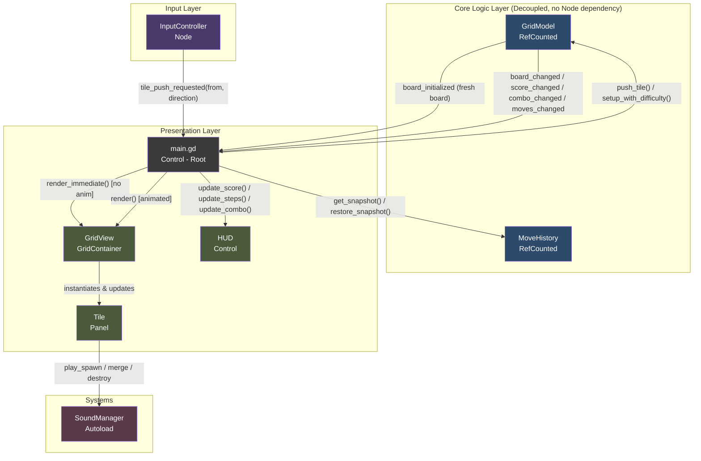
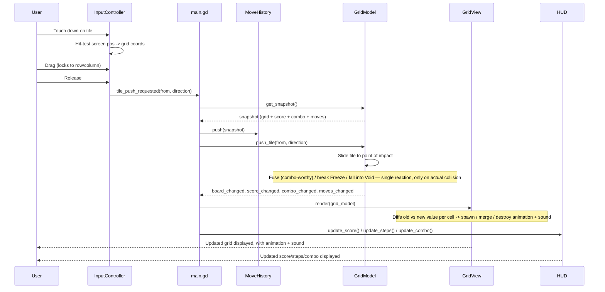

# Quantum Fuse

A deterministic, grid-based mobile puzzle game built in Godot 4. Players drag a single
subatomic particle tile along a row or column, pushing any tiles ahead of it. On release,
the game resolves exactly one reaction at the point of impact — a matching fusion, a
Freeze break, or a Void fall — then updates score, combo, and remaining moves.

## Core Gameplay

- **Drag-and-Push Input** — select a tile, drag along a row or column; the drag locks to
  whichever axis you move first. Releasing pushes the tile (and any tiles already ahead
  of it) as far as the grid boundary, a wall, or another tile allows.
- **Fusion** — if the tile's push ends by colliding with a tile of the same value, they
  merge into one tile of double the value, and score increases by that amount times the
  current combo multiplier.
- **Obstacles:**
  - **Blocked** — an immovable wall. Cannot be dragged, cannot be pushed. Stops sliding
    completely and never breaks.
  - **Freeze** — cannot itself be selected or dragged. Blocks sliding like a wall, but a
    tile colliding into it shatters the Freeze tile, clearing that cell. The pushed tile
    slides up to the point of impact first, then the Freeze clears.
  - **Void** — a pitfall. A tile whose push path leads onto a Void cell falls in and is
    destroyed, regardless of how far it travelled first.
- **Combo Multiplier** — builds only on consecutive **fusions**. The first fusion in a
  streak scores at `x1`; a second fusion immediately after raises it to `x2`, and so on.
  Any move that doesn't result in a fusion (a plain slide, a Freeze break, or a Void fall)
  resets the multiplier back to `x1`.
- **Undo** — every move snapshots the board state beforehand, so a single tap restores
  the previous grid, score, combo, and remaining-move count exactly.
- **Win / Lose States** — reaching the difficulty's target score wins the level; running
  out of remaining moves ends the game.
- **Difficulty Scaling** — Easy / Medium / Hard adjust wall, Freeze, and Void density,
  target score, and move limit via `setup_with_difficulty()`.

## Architecture

The codebase is split into three layers with strict one-way data flow, so the grid's
logical state has zero knowledge of how — or whether — it's being rendered.

| Layer            | Files                                                                                       | Responsibility                                                                                                                                                 |
| ---------------- | ------------------------------------------------------------------------------------------- | -------------------------------------------------------------------------------------------------------------------------------------------------------------- |
| **Core Logic**   | `scripts/core/grid_model.gd`, `scripts/core/move_history.gd`                                | Pure `RefCounted` classes. No `Node` inheritance, no scene tree access. Hold the grid as a plain 2D array and expose signals when state changes.               |
| **Input**        | `scripts/input/input_controller.gd`                                                         | Converts raw touch/drag events into a grid coordinate and a locked direction. Emits a single signal describing player intent — has no knowledge of game rules. |
| **Presentation** | `scripts/main.gd`, `scripts/view/grid_view.gd`, `scripts/view/tile.gd`, `scripts/ui/hud.gd` | Reads model state via signals and renders it, including spawn/merge/destroy animations and sound. Never mutates grid data directly.                            |
| **Systems**      | `scripts/systems/sound_manager.gd`                                                          | Autoload singleton. Pools `AudioStreamPlayer` nodes and plays sound effects by key; missing audio files are skipped safely rather than crashing.               |

`GridModel` never imports or references any Control/Node — this keeps the grid's data
structure entirely independent from the visual rendering layer. Everything the view layer
knows about the board comes through signals: `board_initialized` (a fresh board, rendered
instantly with no animation/sound), `board_changed` (a real move, rendered with animation
and sound), `score_changed`, `combo_changed`, `moves_changed`, `game_over`, and `game_won`.

### System Architecture Map

### Functional Code Flow

## Algorithmic Notes

- **Undo memory safety** — `MoveHistory` stores a shallow-duplicated 2D array
  (`row.duplicate()` per row) plus score/combo/move-count integers per snapshot, not deep
  object copies or scene state. The history stack is capped to bound memory growth over a
  long play session.
- **Single point-of-impact reactions** — a push only ever triggers a reaction (fuse, Void
  fall, or Freeze break) if the tile actually moved and landed adjacent to something as a
  direct result of that specific move. A tile that can't move at all never triggers a
  reaction, avoiding false-positive reactions on stationary tiles.
- **Combo streak is fusion-only** — `combo_worthy` is set only on a fusion, not on a
  Freeze break or Void fall, so hazards never reward the player with a growing multiplier.
  The streak resets to `x1` whenever a move doesn't produce a fusion.
- **Animation/sound decoupling** — `GridView` never decides _whether_ to play a sound; it
  detects value transitions per cell (empty→value = spawn, value→empty = destroy,
  value→different value = merge) and delegates to `Tile`, which calls the shared
  `SoundManager` autoload rather than owning its own `AudioStreamPlayer` per instance.
- **Fresh-board vs. live-move rendering** — `setup()` / `setup_with_difficulty()` emit
  `board_initialized`, routed to `GridView.render_immediate()` (no animation, no sound,
  resyncs the view's internal value-tracking state). Actual gameplay moves emit
  `board_changed`, routed to the animated `render()`. This avoids a bug where a freshly
  generated board (on restart or level re-entry) would misfire "merge" sounds by
  comparing against stale values left over from a previous game.

## Design Notes & Scope

- **No cascading chain reactions.** Each push resolves at most one reaction. This was a
  deliberate simplification: with drag-and-push (rather than a whole-board shift), a
  single move only ever puts one tile into new contact with its surroundings, so a
  recursive cascade check would add complexity without a clear gameplay payoff.
- **No opposite-charge annihilation.** An earlier design iteration included a rule where
  a positive and negative tile of equal magnitude would destroy each other on contact.
  The shipped version only implements same-value fusion, to keep the core loop focused
  and match the simplified single-collision model above.

## Project Structure

scripts/
├── core/ # GridModel, MoveHistory — pure logic, no Node dependency
├── input/ # InputController — drag detection and direction locking
├── view/ # GridView, Tile — render grid state, never mutate it
├── ui/ # HUD — score/target/steps/combo display, win/lose overlays
├── systems/ # SoundManager — pooled audio playback autoload
└── main.gd # Wires input -> model -> view together
scenes/
├── main.tscn
├── grid/ # GridView + Tile scenes
└── ui/ # HUD, panels

## Running the Project

Open the project in Godot 4.x and run `main.tscn`.
